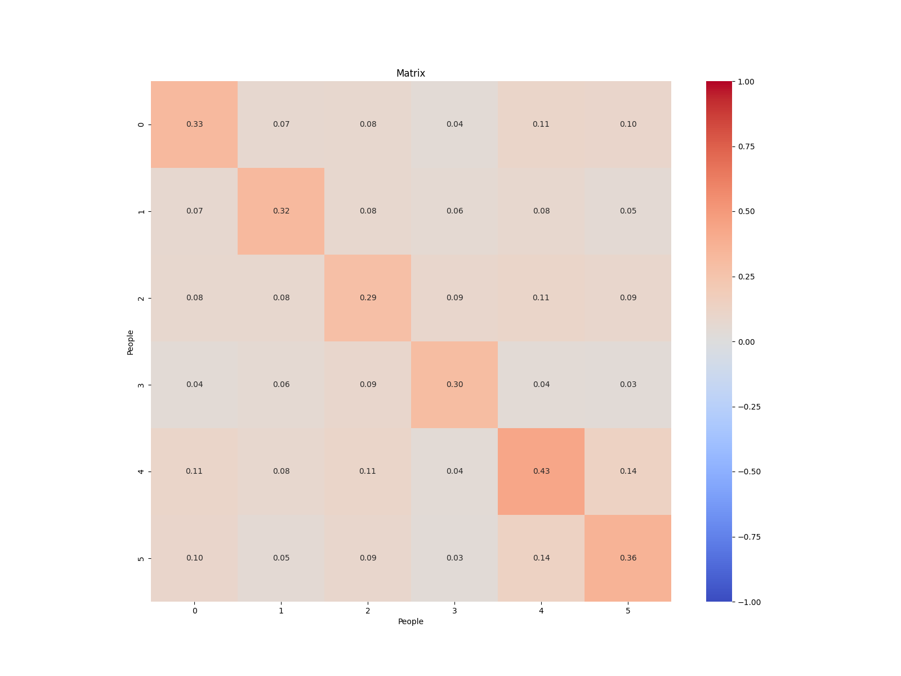
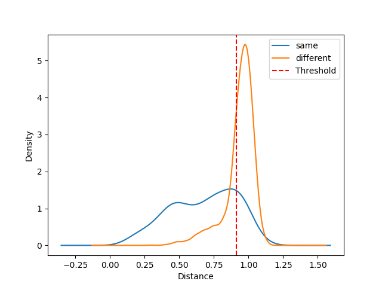

<!-- HEADER START -->
<!-- src: https://github.com/kyechan99/capsule-render -->
<p align="center"><a href="#">
    
</a></p>

<p align="center">
<br>
<a href="mailto:melon345@yonsei.ac.kr">
    
</a>
<a href="https://www.notion.so/y-ai/AI-Park-aa64da8d44c64345ac24c9b040939359">
    
</a>
<a href="https://www.notion.so/y-ai/7b3780c8172c425d87f6174ed159d99a?pvs=4">
    
</a>
</p>
<br>
<hr>
<!-- HEADER END -->

# Improving performance of Face Recogition for virtual human generation 👩‍💼
<br>Face recognition model for virtual human generation<br>

# Members 👋
<b> <a href="https://github.com/JungKH33">정경훈</a></b>&nbsp; :&nbsp; YAI 12th&nbsp; /&nbsp; melon345@yonsei.ac.kr<br>
<b>  <a href="https://github.com/jmjmfasdf">서정민</a></b>&nbsp; :&nbsp; YAI 12th&nbsp; /&nbsp; jmme425@yonsei.ac.kr  <br>
<b> <a href="https://github.com/Nugu-ai">박승호</a></b>&nbsp; :&nbsp; YAI 12th&nbsp; /&nbsp; gomi0904@yonsei.ac.kr <br>
<b> <a href="https://github.com/Tim3s">홍지우</a></b>&nbsp; :&nbsp; YAI 12th&nbsp; /&nbsp; jiwoo0729@yonsei.ac.kr <br>
<hr>

# Getting Started 🔥
This project is based on the code from [DeepFace](https://github.com/serengil/deepface). We would like to acknowledge the contributors and maintainers of that repository for their valuable work.
For detailed usage instructions and examples, please refer to the original repository's README.md file and documentation.
## Setup

Before installing DeepFace, ensure you have Python 3.5.5 or higher installed. If you want to utilize GPU acceleration, you'll need to install TensorFlow with CUDA support prior to installing DeepFace.

### GPU Installation (Optional)

To enable GPU support, install TensorFlow with CUDA by running:

```bash
pip install tensorflow[and-cuda]
```

### Installation Steps 
To install deepface, follow these steps:

1. Clone the repository:
```bash
git clone https://github.com/JungKH33/face-similarity.git
```

2. Navigate to the cloned directory:
```bash
cd deepface
```
3. Install deepface:
```bash
pip install -e .
```

### Download pretrained models
To use AdaFace, download the ONNX file from [this link](https://drive.google.com/drive/folders/10_FVXnofz0EJh3bbWRoGN84ATHCZ66IE?usp=drive_link) and place it in the `weights/adaface` folder.
You can change the directory if you modify the model_path variable in `deepface/basemodels/AdaFace`.

### Download Datasets 

The dataset we have provided can be downloaded from [this link](https://drive.google.com/drive/folders/1xQKjGDVOKOCC43JnXeyhbQcSug-U5474).

If you want to add a custom dataset, the dataset should be in the following structure:

```
📦 dataset_folder
├─ person_1
│  ├─ image1.jpg
│  ├─ image2.jpg
│  └─ ...
├─ person_2
│  ├─ image1.jpg
│  ├─ image2.jpg
│  └─ ...
└─ person_3
   ├─ image1.jpg
   ├─ image2.jpg
   └─ ...
```

## Usage 

### Calculate Similarity

This script calculates the average similarity between multiple people. If a save path is not specified, it plots the similarity matrix; otherwise, it saves the similarity matrix to the specified path. 
You can run the script with the following command:

```bash
python similarity.py --i <path_to_dataset> --o <path_to_save_directory> --n <number_of_pairs> [--model <model_name>] [--backend <backend_name>] [--metric <metric_name>]
```

You can see the available models and backends by running:
```bash
python similarity.py --help
```



*Figure 1: Example similarity matrix generated by the script. Each cell represents the similarity score between two individuals. Red colors indicate higher similarity, while blue colors indicate lower similarity.*
### Calculate Accuracy

This script calculates the accuracy of a model. You can test different models, backends and thresholds which fits your dataset best.

```bash
python accuracy.py --i <path_to_dataset> --o <path_to_save_directory> --n <number_of_pairs> [--model <model_name>] [--backend <backend_name>] [--metric <metric_name>]
```

You can see the available models, backends, and metrics by running:
```bash
python accuracy.py --help
```



*Figure 2: Example density graph created by the script. It calculates the appropriate threshold and its corresponding accuracy.*

# Building on DeepFace for experiments 🏗️🔬

## 0. DeepFace - [Link](https://github.com/serengil/deepface)
Deepface is a lightweight face recognition and facial attribute analysis (age, gender, emotion and race) framework for python. It is a hybrid face recognition framework wrapping state-of-the-art models: VGG-Face, Google FaceNet, OpenFace, Facebook DeepFace, DeepID, ArcFace, Dlib, SFace and GhostFaceNet.

## 1. AdaFace - [Link](https://github.com/mk-minchul/AdaFace)
[AdaFace: Quality Adaptive Margin for Face Recognition](https://arxiv.org/abs/2204.00964)

AdaFace is a novel approach for face recognition in low-quality datasets. AdaFace enhances the margin-based loss function by adapting to image quality, assigning varied importance to easy and hard samples based on their quality. By approximating image quality through feature norms, AdaFace outperforms state-of-the-art methods on multiple datasets, including IJB-B, IJB-C, IJB-S, and TinyFace.

## 2. Implement Adaface on Deepface by using ONNX
Although the recognition model initially did not include AdaFace, we wanted to incorporate AdaFace into the deepface library to evaluate its performance.

We attempted to import the pretrained weights provided on the AdaFace GitHub repository into the deepface library. To facilitate interoperability and sharing between different deep learning frameworks, we utilized the ONNX open-source project to integrate the AdaFace model into deepface for comparison alongside other models. As a result, the AdaFace model could be utilized within the deepface library, allowing for comprehensive comparisons with other models.

# Dataset 😊
We made our own datasets to evaluate various combination of model and backend(detection). To evaluate the robustness of each features, we prepared datasets that can represent key features affect face similarity. We picked 6 to 14 identities considering gender, race, age from the datasets below.

## 1. Digiface
Digiface is a collection of over one million diverse synthetic face images for face recognition. There are 720k images with 10K identities containing various face angle, accessories, emotion and hairstyle. We chose 6 identities for fast inference.

## 2. Hairstyle
We collected various hairstyle images generated from several GAN based models([Styleyourhair](https://github.com/Taeu/Style-Your-Hair), [Barbershop](https://github.com/ZPdesu/Barbershop)). This dataset contains one original image and several images based on oringal image.

## 3. Makeup
We collected various makeup images of same identity generated from GAN based models([LADN](https://github.com/wangguanzhi/LADN)). This dataset contains one original image and several makeup images based on original image. In addition, these dataset has subfolders for each identity, one is similar makeup images compared to original image, the other subfolder contains less similar images compared with original images.

## 4. Rotation
[Multi-PIE](https://www.cs.cmu.edu/afs/cs/project/PIE/MultiPie/Multi-Pie/Home.html) contains pictures of multiple angle of same identity. 


# Metrics 📋
To find best model combination, we made inference metric of our own. You can test our metric on the datasets above. The model combination we tested is shown as below.
```
model = [
  "VGG-Face",
  "Facenet",
  "Facenet512",
  "OpenFace",
  "DeepFace",
  "DeepID",
  "ArcFace",
  "SFace",
  "AdaFace"
]

backends = [
  'opencv', 
  'ssd', 
  'mtcnn', 
  'retinaface', 
  'mediapipe',
  'yolov8',
  'yunet',
  'fastmtcnn',
]
```


## Skills
Frameworks <br> 

## Citations
Models
```bibtex
@inproceedings{kim2022adaface,
title={AdaFace: Quality Adaptive Margin for Face Recognition},
author={Kim, Minchul and Jain, Anil K and Liu, Xiaoming},
booktitle={Proceedings of the IEEE/CVF Conference on Computer Vision and Pattern Recognition},
year={2022}
}
```
```bibtex
@inproceedings{serengil2020lightface,
  title = {LightFace: A Hybrid Deep Face Recognition Framework},
  author = {Serengil, Sefik Ilkin and Ozpinar, Alper},
  booktitle = {2020 Innovations in Intelligent Systems and Applications Conference (ASYU)},
  pages = {23-27},
  year = {2020},
  doi = {10.1109/ASYU50717.2020.9259802},
  url ={https://doi.org/10.1109/ASYU50717.2020.9259802}, organization = {IEEE}
}
```
Datasets
```bibtex
@inproceedings{bae2023digiface1m,
    title={DigiFace-1M: 1 Million Digital Face Images for Face Recognition},
    author={Bae, Gwangbin and de La Gorce, Martin and Baltru{\v{s}}aitis, Tadas and Hewitt, Charlie and Chen, Dong and Valentin, Julien and Cipolla, Roberto and Shen, Jingjing},
    booktitle={2023 IEEE Winter Conference on Applications of Computer Vision (WACV)},
    year={2023},
    organization={IEEE}
}

```
```bibtex
@article{jin2018community,
    title={A community detection approach to cleaning extremely large face database},
    author={Jin, Chi and Jin, Ruochun and Chen, Kai and Dou, Yong},
    journal={Computational intelligence and neuroscience},
    volume={2018},
    year={2018},
    publisher={Hindawi}
}
```
```bibtex
@article{kim2022style,
  title={Style Your Hair: Latent Optimization for Pose-Invariant Hairstyle Transfer via Local-Style-Aware Hair Alignment},
  author={Kim, Taewoo and Chung, Chaeyeon and Kim, Yoonseo and Park, Sunghyun and Kim, Kangyeol and Choo, Jaegul},
  journal={arXiv preprint arXiv:2208.07765},
  year={2022}
}
```
```bibtex
@misc{zhu2021barbershop,
      title={Barbershop: GAN-based Image Compositing using Segmentation Masks},
      author={Peihao Zhu and Rameen Abdal and John Femiani and Peter Wonka},
      year={2021},
      eprint={2106.01505},
      archivePrefix={arXiv},
      primaryClass={cs.CV}
}
```
```bibtex
@inproceedings{gu2019ladn,
  title={Ladn: Local adversarial disentangling network for facial makeup and de-makeup},
  author={Gu, Qiao and Wang, Guanzhi and Chiu, Mang Tik and Tai, Yu-Wing and Tang, Chi-Keung},
  booktitle={Proceedings of the IEEE International Conference on Computer Vision},
  pages={10481--10490},
  year={2019}
}
```
```bibtex
@article{gross2010multi,
  title={Multi-pie},
  author={Gross, Ralph and Matthews, Iain and Cohn, Jeffrey and Kanade, Takeo and Baker, Simon},
  journal={Image and vision computing},
  volume={28},
  number={5},
  pages={807--813},
  year={2010},
  publisher={Elsevier}
}
```


